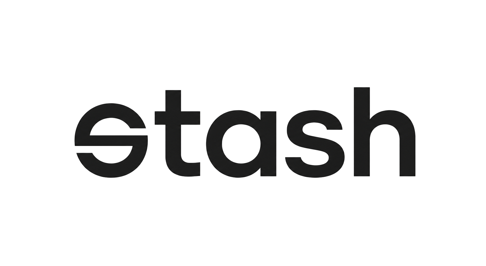
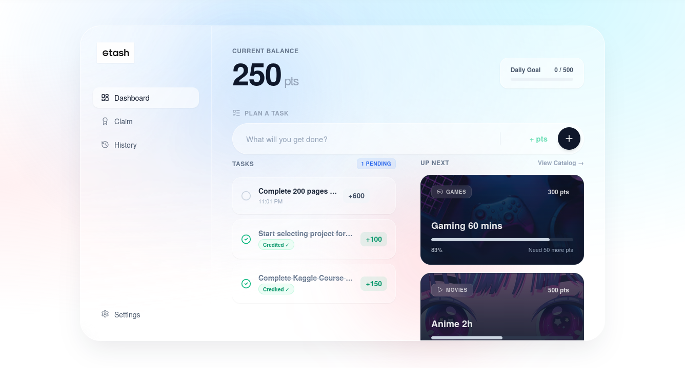
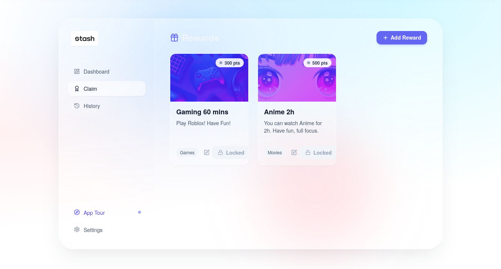
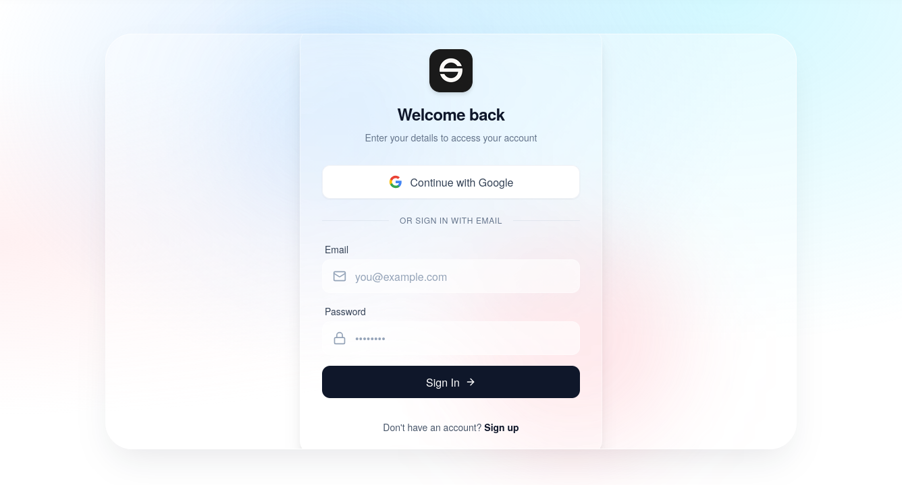

<div align="center">
  
  
  <p><strong>A sleek, personal productivity and self-gamification app.</strong><br>
  <em>Turn your tasks into a rewarding personal economy!</em></p>

  <p>
    <a href="https://stash-vimalarul.vercel.app/"><strong>Live Demo</strong></a> ·
    <a href="#-getting-started"><strong>Self-Hosting</strong></a> ·
    <a href="#-tech-stack"><strong>Tech Stack</strong></a>
  </p>
</div>

---

## 🌐 Live App

You can try out Stash right now without installing anything! 
**Play with the live version here:** [https://stash-vimalarul.vercel.app/](https://stash-vimalarul.vercel.app/)

## 📸 Screenshots

<div align="center">
  
  
  <br><br>
  
</div>

## 🚀 Getting Started

There are two ways to run Stash yourself, depending on your needs:

### 🐳 1. Self-Hosting (Docker)
**Best for:** Running your own permanent, production-ready instance. 
This method spins up the optimized frontend and a local Supabase database behind the scenes in one command.

1. Install [Docker](https://docs.docker.com/get-docker/) and [Docker Compose](https://docs.docker.com/compose/install/).
2. Clone the repository:
   ```bash
   git clone https://github.com/your-username/stash.git
   cd stash
   ```
3. Run the app:
   ```bash
   docker-compose up --build -d
   ```
4. Access Stash at `http://localhost:3000`.

### 💻 2. Local Development (Node.js)
**Best for:** Modifying the code, fixing bugs, or adding new features to the app. 
This runs a fast development server with hot-reloading. Data is stored securely in your browser (Local Storage Mode).

1. Install dependencies:
   ```bash
   npm install
   ```
2. Start the Vite dev server:
   ```bash
   npm run dev
   ```
3. Access Stash at `http://localhost:5173`.

## 🛠️ Tech Stack

- **Framework:** React 19 + TypeScript (Vite)
- **Styling:** Tailwind CSS (Glassmorphism design)
- **State:** Zustand
- **Animations:** Framer Motion
- **Icons:** Lucide React
- **Backend:** Supabase (Optional)
- **Deployment:** Docker & Vercel Ready

## 📜 License

This project is licensed under the MIT License - see the [LICENSE](LICENSE) file for details.
